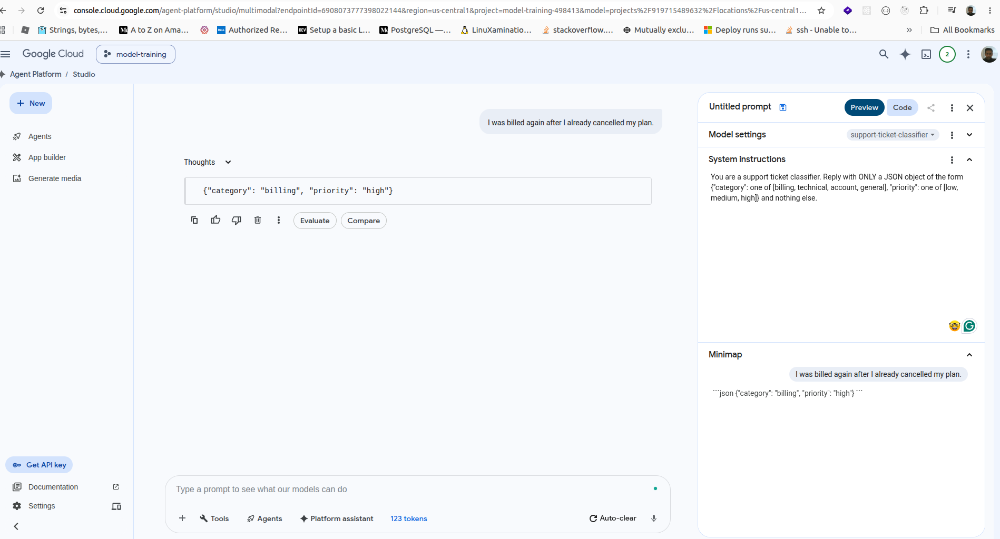
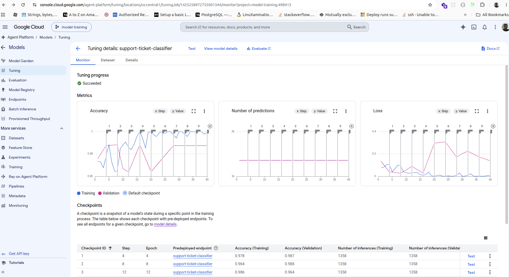

# Fine-tuning practice: hands-on milestones

My training log. I edit this by hand as I work through each module. Flip the status,
write down what I actually ran, paste loss numbers, note what broke.

Status: [ ] not started, [~] in progress, [x] done

| # | Module | Folder | Status |
|---|--------|--------|--------|
| 1 | LoRA/QLoRA SFT | 01_lora_sft/ | [x] |
| 2 | Dataset from scratch | 02_dataset_from_scratch/ | [x] |
| 3 | Synthetic data | 03_synthetic_data/ | [x] |
| 4 | Embedding fine-tune | 04_embedding_finetune/ | [x] |
| 5 | Model merge | 05_model_merge/ | [x] |
| 6 | Multimodal fine-tune | 06_multimodal_finetune/ | [x] |
| 7 | Vertex AI managed tune (optional) | 07_vertex_ai_managed/ | [x] |
| 8 | Serving fine-tuned models (lighter touch) | 08_serving_finetuned/ | [ ] |

Rule for every module: small models, small datasets. The point is reps and
understanding, not benchmark scores.

---

## 1. LoRA/QLoRA SFT
Goal: fine-tune a small Qwen model on a small instruction dataset, start to finish.
Read the loss curve. Test before and after.

- [x] Ran train_lora.py to the end
- [x] Looked at the loss curve (going down? flat? overfitting?) - going down then flat
- [x] Tested the base model (test_base.py), the "before"
- [x] Tested the tuned adapter (test_adapter.py), the "after"
- [x] Wrote down a before/after difference I can actually see

Notes:
- Final loss: 40 steps, 1 epoch. 3.95 -> 3.57 then flat around 3.63. Dropped early
  then plateaued. Only 4 logged points so the curve is rough. Run was just too short
  to see more.
- Before vs after: first try looked very different but that was a prompting bug, not
  the model. The adapter test used a raw prompt while the base test used the chat
  template, so the adapter went into free-completion mode and rambled / made up facts
  about Paris. Once both used the same chat template, they give basically the same
  clean answer ("The capital of France is Paris").
- Lesson: a tiny LoRA on a tiny general dataset makes a small, subtle change. To see an
  obvious before/after I need a narrow task the base model fails at. That is module 2.
- Knobs to remember: more EPOCHS and smaller logging_steps give a smoother, more
  readable loss curve. Lower MAX_SEQ_LEN or raise GRAD_ACCUM if I hit out of memory.

---

## 2. Dataset from scratch
Goal: hand-build a tiny task-specific dataset in instruction/JSONL format and train
on it, so I actually do the data shaping myself.

- [x] Picked the task (support ticket -> strict JSON {category, priority})
- [x] Hand-wrote 24 examples in JSONL (+ 6 held-out eval)
- [x] Trained on it (on Kaggle)
- [x] Tested the result (before/after with scoring)

Notes:
- Training worked: loss dropped to ~0.23, mean_token_accuracy ~0.94. The local bf16 run
  reproduced the Kaggle loss curve and ran clean (no precision crash).
- Before/after on the 6 held-out cases (from the full local bf16 run):
    base    -> valid JSON 6/6, category 2/6, exact 1/6
    adapter -> valid JSON 6/6, category 6/6, exact 4/6
- This is a clear win. Category accuracy went 2/6 -> 6/6 (perfect). The base defaulted
  everything to technical/high; the adapter gets every category right, including phrasings
  NOT in the training set (Slack->general, reset-password->account, billed-after-cancelled
  ->billing). So 24 examples was enough to generalize once it trained to a low enough loss.
- The only 2 misses are priority, and both are subjective (billed-after-cancelled high vs
  medium, reset-password low vs medium). My labels are one valid call, the model picked
  another reasonable one.
- Format was never the gap: Qwen-0.5B-Instruct already emits valid JSON from the system
  prompt, so both score 6/6. The win here is the classification, not the format.
- Watch out: an earlier Kaggle adapter only scored exact 2/6 / category 2/6. Same data,
  but it trained to a higher loss (~0.70) on T4 fp16. That weaker run understated what the
  data could do. Lesson: "barely helped" was really "undertrained", not "bad data". Train
  to a low loss before judging a dataset.
- Possible extensions: add more examples (especially varied priorities) to nail the last
  2 priority calls, or drop the system prompt so the format itself has to be learned.

---

## 3. Synthetic data
Goal: use an LLM to paraphrase a few examples into a bigger set (more variety, not new
facts), then eyeball or judge-filter the quality.

- [x] Picked seed examples (the 24 from module 2)
- [x] Expanded them with an LLM (local Ollama, qwen2.5:3b-instruct, x5 per seed)
- [x] Filtered for quality (dedup, near-dup, eval-leak, bad-label drops)
- [x] Trained and compared against the small seed set

Notes:
- Local path: ran the paraphraser through Ollama on localhost, so seeds never left the
  machine. Privacy-preserving SDG workflow. keep_alive: 0 so the 3B unloads from VRAM
  before train.py (otherwise the 4 GB card OOMs running both at once).
- Same task and same 6 held-out eval as module 2, so scores compare directly.
- Results on the held-out set:
    base            -> valid JSON 6/6, category 2/6, exact 1/6
    module 2 (seeds)-> valid JSON 6/6, category 6/6, exact 4/6
    module 3 (synth)-> valid JSON 6/6, category 6/6, exact 5/6
- So synthetic data helped: exact 4/6 -> 5/6, category stayed perfect. The gain was on
  priority, which is exactly what module 2 missed. The extra worded variety gave the
  model more signal about how phrasing maps to priority.
- Training was healthy (final loss ~0.21). num_tokens ~62k vs module 2's ~16k confirms
  the paraphrases roughly 4x'd the data.
- Caveat: the eval is only 6 cases, so 4/6 -> 5/6 is one example flipping. Directionally
  right and consistent with the idea, but not a precise number. Honest claims: it did not
  hurt, category stayed perfect, one stubborn priority call got fixed.
- The last miss is a subjective priority call. To chase 6/6 I would add targeted priority
  examples or accept the labels are fuzzy.

---

## 4. Embedding fine-tune
Goal: fine-tune a small embedding model with hard-negative mining, and measure a
retrieval metric before and after on my own small set.

- [x] Picked a small embedding model and a tiny retrieval set (all-MiniLM-L6-v2; ~18-doc
      support help corpus + query/answer pairs)
- [x] Mined hard negatives (mine_negatives.py: top-ranked non-positive docs per query)
- [x] Measured the retrieval metric BEFORE (Recall@1/3, MRR@10)
- [x] Fine-tuned (MultipleNegativesRankingLoss on the mined triplets)
- [x] Measured the retrieval metric AFTER

Notes:
- Pipeline: evaluate.py (before) -> mine_negatives.py -> train.py -> evaluate.py (after).
  Base model is sentence-transformers/all-MiniLM-L6-v2; loss is MultipleNegativesRanking
  (in-batch negatives + the mined hard negatives). notes.md has the concept Q&A.
- Result: the base model already scored a PERFECT 1.00 on Recall@1, Recall@3, and MRR@10
  on the held-out queries, so the fine-tune had no headroom and also scored 1.00. No
  visible before/after.
- This is a legitimate, instructive finding, not a failure: when the base model already
  solves the task, fine-tuning adds nothing, and the metric proves it. The corpus was too
  small and topically distinct (billing vs password vs Slack vs dark mode) for a strong
  general retriever to get anything wrong.
- To actually see hard-negative mining pay off I would need a harder corpus: confusable
  near-duplicate docs (cancel vs pause subscription, reset vs change password, enable vs
  disable 2FA, add vs remove teammate) so the base makes mistakes there is room to fix.
- Lesson learned anyway: ran the full embedding pipeline (mine -> train -> measure) and
  saw why a saturated baseline leaves no room for improvement, and how to design a harder
  eval if I want one.

---

## 5. Model merge
Goal: merge a fine-tuned model with its base using MergeKit and see what changes.

- [x] Installed MergeKit (0.1.4)
- [x] Merged tuned + base (linear interpolation at alpha 0.25 / 0.50 / 0.75)
- [x] Compared behavior before and after the merge

Notes:
- Setup: baked module 3's adapter into the base (peft merge_and_unload) to get a full
  fine-tuned model, since MergeKit merges full weights, not adapters. Then linear-merged
  it with the base: merged = alpha*finetune + (1-alpha)*base.
- Scores on the same 6-case task (category / exact), plus a general probe ("capital of
  France", all answered Paris correctly):
    base       -> category 2/6, exact 1/6
    merge-25   -> category 3/6, exact 2/6
    merge-50   -> category 6/6, exact 5/6
    merge-75   -> category 6/6, exact 6/6
    finetuned  -> category 6/6, exact 5/6
- Clean dial: as the fine-tune weight rises, task skill blends in monotonically.
- Surprise and the best lesson: merge-75 (75% finetune + 25% base) beat the PURE
  finetune (exact 6/6 vs 5/6). Mixing a bit of base back in fixed the last priority call.
  That is the regularization effect of merging, a blend can generalize better than either
  parent, not just average them.
- General ability survived the whole curve (Paris answered correctly everywhere).
- Caveat: 6-case eval and a single general probe, so 6/6 vs 5/6 is one example. The
  direction matches a known phenomenon but is not proof.
- Gotchas: mergekit 0.1.4 crashes under transformers 5.x ("ConfiguredModuleArchitecture
  is not fully defined"); merge.py patches it by rebuilding the pydantic models with torch
  in scope and runs via the API. MergeKit also does not copy the chat template into the
  merged dir, so merge.py copies chat_template.jinja over.

---

## 6. Multimodal fine-tune
Goal: run a small VLM fine-tune on an image-QA dataset to get the multimodal flow and
the freeze vs train choice.

- [x] Picked a small VLM and an image-QA set (SmolVLM-256M-Instruct; synthetic shapes)
- [x] Decided what to freeze vs train (froze vision encoder, LoRA the language model)
- [x] Fine-tuned (loss 7.97 -> 2.94, ~90s on the 4 GB GPU)
- [x] Tested on a held-out image (12 held-out images, before/after)

Notes:
- Multimodal flow: image -> vision encoder -> features projected into the LM's token
  space -> LM generates the answer from image tokens + question. Built a synthetic
  image-QA set with make_data.py (one colored shape per image, ask color or shape).
- Freeze vs train: added LoRA to the language model only and froze the vision encoder.
  Tricky bit: vision and text share proj names (q/k/v_proj), so a plain target list would
  adapt vision too. Scoped LoRA with a regex matching only model.text_model.* (210
  adapters, 0 on vision, confirmed).
- Before/after on 12 held-out images, two metrics:
    metric                       base    fine-tuned
    contains right word (lenient) 12/12   11/12
    exact one-word (strict)        4/12   11/12
- The fine-tune changed the OUTPUT FORMAT, not the seeing. Base answers verbosely ("The
  shape in the image is a square"); adapter answers one word ("square"). Strict exact
  jumped 4/12 -> 11/12. It did NOT improve vision: base already saw shapes (lenient 12/12),
  and because the vision encoder was frozen, the one real visual slip (square called
  circle) stayed wrong. That is the freeze choice made concrete: train the language side,
  leave the seeing alone.
- Metric design matters: the lenient substring metric hid the change (even looked like a
  regression 12 -> 11); the strict metric revealed the format learning.
- 4 GB GPU gotchas: VLMs OOM easily. Fixes that made it fit: do_image_splitting=False
  (biggest lever, far fewer image tokens), batch size 1 + grad accum 8, and
  PYTORCH_CUDA_ALLOC_CONF=expandable_segments:True. Also needed torchvision installed
  (transformers 5.x image processors require it).

---

## 7. Vertex AI managed tune (optional)
Goal: run one Vertex AI Gemini supervised tune from the codelab to feel the managed
workflow and compare it to local training.

- [x] Prepared the managed workflow (data converted, scripts ready, contrast written)
- [x] Actually ran the cloud tune (Vertex AI, Gemini supervised tune, via the console UI)
- [x] Tested the tuned model in Vertex AI Studio (correct JSON on a held-out ticket)
- [x] Noted the differences vs local (control, cost, speed, visibility)

Notes:
- Scaffolded the managed path with the same support-ticket classifier task. Only the data
  conversion runs locally; the tune itself needs Google Cloud.
- make_dataset.py converts the module 2 data into Vertex Gemini tuning JSONL. The format
  differs from our local TRL format: roles are user/model (not assistant), text sits under
  parts: [{"text": ...}], and the system prompt is a separate systemInstruction. Converted
  and validated (24 train + 6 eval).
- tune.py and predict.py are templates (fill in GCP project/bucket/endpoint). The whole
  "training" is one sft.train() call; Google provisions hardware, tunes a LoRA on Gemini,
  serves it behind an endpoint. You never see GPUs, the loss loop, or the weights.
- Local vs managed, the actual lesson:
    local  -> full control + visibility + free, but I write the loop and fight 4 GB OOM,
              and I am limited to small open models.
    managed-> upload + one call, scales to a frontier model from a laptop, but I give up
              the weights and internals and pay money, and data leaves my machine.
  Same idea (supervised LoRA on a small dataset), opposite ends of the effort/control axis.
- Ran it for real on Vertex AI through the console UI: created a GCS bucket, uploaded
  vertex_train.jsonl / vertex_eval.jsonl, started a Gemini supervised tuning job, watched
  the loss curve in the console, and tested the tuned model in Vertex AI Studio.
- Test result: on the held-out ticket "I was billed again after I already cancelled my
  plan." the tuned model returned {"category": "billing", "priority": "high"}, which is
  the correct label. So the managed tune worked, same task, same clean JSON output as the
  local fine-tunes.
- Console gotchas: the API to enable is "Vertex AI API" (aiplatform.googleapis.com), not
  the Vertex AI Vision / Search-for-commerce ones. The console now routes Vertex AI under
  an "Agent Platform / model-training" rebrand, the tuning page is Vertex AI Studio ->
  Tuning. The job shows "completed" then keeps running for a bit while it registers and
  deploys the tuned model to an endpoint (one job, multiple stages, not a re-run).
- Screenshot of the successful test: screenshots/vertex_tune_test.png (saved by hand).

Tuning job dashboard in the console (accuracy, predictions, loss curves, and the saved checkpoints):

---

## 8. Serving fine-tuned models (lighter touch)
Goal: understand how a trained model gets used in production, serving with an inference
engine (vLLM), multi-LoRA serving, and GGUF export for local runtimes (Ollama, llama.cpp).

- [ ] Understood what an inference engine (vLLM) does vs plain transformers
- [ ] Understood multi-LoRA serving (one base, many adapters, switched per request)
- [ ] Scaffolded the serving paths (vLLM multi-LoRA + Ollama/GGUF) against this repo's artifacts
- [ ] Actually stood up vLLM and hit it (optional; needs more VRAM + the vllm install)

Notes:
- This is the reference/lighter-touch module: more "know how it is served" than heavy
  hands-on. Files in 08_serving_finetuned/: README (the concepts + both Q&As), serve_vllm.sh,
  client.py, Modelfile.
- vLLM vs transformers: plain model.generate is fine for experiments but a poor server,
  one-at-a-time, naive KV cache, idle GPU. vLLM is a serving engine: PagedAttention (KV
  cache managed like paged virtual memory, packs many sequences in), continuous in-flight
  batching (add/remove sequences token by token to keep the GPU saturated), optimized
  kernels, and an OpenAI-compatible server. Result: far higher throughput under load.
- Multi-LoRA serving: a LoRA is a small delta on a frozen base, and many adapters share
  the SAME base. So load ONE base + N tiny adapters; each request names which adapter it
  wants, and special kernels can serve a batch using different adapters at once. Hosting
  10 specialists then costs ~1 base of VRAM, not 10. One container serves a fleet of
  specialists, routed per request. serve_vllm.sh loads the 01 and 03 adapters on one base;
  client.py picks the specialist via the OpenAI `model` field.
- GGUF / Ollama: the opposite end from vLLM, a quantized format for local/CPU/edge serving
  (llama.cpp, Ollama). Modelfile imports the module 5 merged model into Ollama
  (ollama create ... -f Modelfile). Convert with llama.cpp convert_hf_to_gguf.py for a real
  .gguf + quantization (q4_K_M).
- When to use which: vLLM for production GPU serving at scale; vLLM multi-LoRA for several
  specialists of one base; GGUF + Ollama/llama.cpp for local, offline, CPU or small GPU.
