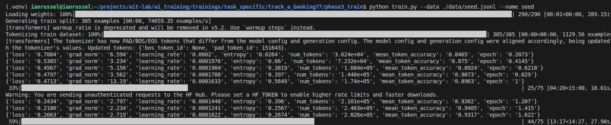

# Task-Specific Training from a Text Corpus: progress

My hands-on log for the corpus-to-specialist deep dive (see
TaskSpecific_Training_From_Corpus.pdf). I edit this by hand as I work through it. The goal
is durable mastery of one workflow: take a messy corpus (tickets, docs, FAQs), build a
clean training set with synthetic data, train a small LoRA specialist, and evaluate it
honestly on two axes. Runs go on Kaggle / Colab. Small models, small data.

Status: [ ] not started, [~] in progress, [x] done

| Phase | What | Status |
|-------|------|--------|
| 0 | Setup (local GPU + Ollama) | [x] |
| 1 | Define the task + build seed data | [x] |
| 2 | Synthetic data generation (the core) | [x] |
| 3 | Train the LoRA/QLoRA specialist | [x] |
| 4 | Evaluation done right (two axes) | [x] |
| 5 | Iterate | [x] |
| A | Track A: banking77 classification specialist | [x] |
| B | Track B: corpus-grounded specialist | [~] |
| W | Write-up (what to produce) | [ ] |
| R | Reading list (papers) | [ ] |

## Disciplines I must not skip (the doc says these are where specialists silently fail)

- The held-out gold set is sacred: reserve it before any synthetic generation, and never
  let anything derived from it enter training.
- Do not fabricate facts. Vary phrasing/structure/persona freely, but the factual content
  must stay anchored to verified source material (keep the verified label; for grounded
  generation keep the answer faithful to a real passage).
- Decontaminate: make sure no generated row overlaps the gold set or any benchmark I
  measure on (n-gram / MinHash ~13-gram shingles). Do this before training.
- Evaluate two axes every time, against the same baseline: did it learn the task, and did
  anything else get worse (regression / catastrophic forgetting).
- Set acceptance criteria before training (minimum task gain, max tolerated general
  regression), then report honestly against them.

## The end-to-end pipeline (the mental model to hold before touching code)

1. Define the task precisely (exact input, exact output, exact success metric).
2. Build a small seed set from the corpus (real, verified examples in that exact shape).
3. Expand with synthetic data (variety, and for generation grounded coverage, no fabrication).
4. Filter for quality (judge, dedup, decontaminate, balance).
5. Train a LoRA/QLoRA specialist.
6. Evaluate on two axes (task gold-set + regression guard).
7. Iterate (error-analyze, generate targeted data for weak spots, retrain).

---

## Phase 0: Setup
Goal: a GPU environment ready to run the whole pipeline end to end.

- [x] Running locally on my own GPU instead of Kaggle / Colab
- [ ] Kaggle notebook with GPU accelerator on (not used)
- [ ] Colab notebook with GPU runtime (not used)
- [x] Decided where results live between sessions: in the repo (data/ + adapters)

Notes: Went local rather than Colab/Kaggle. The synthetic-data step needs a local
Ollama server on :11434 (the privacy path), and the pipeline passes a fair amount of
shared data between phases (labels, seed, gold, the generated/judged/filtered JSONL,
the adapters); keeping all of that on one machine is simpler than wiring it through a
notebook's ephemeral storage and re-uploading between sessions. Results and adapters
just live in the repo. Confirmed the local GPU trains: screenshot of the Phase 3 seed
run (Qwen2.5-0.5B-Instruct, QLoRA 4-bit) in track_a_banking77/terminallog.png, loss
falling 0.79 -> ~0.22 and mean_token_accuracy rising to ~0.93 across the first two
epochs, so the environment is good for the rest of the work.

Update: added a hybrid cloud path after the local GPU (RTX 3050 Ti Laptop, 4 GB) hit
its ceiling on Track B. Track A trains fine locally (short banking queries, max_len
768), but Track B's long RAFT contexts OOM at the default batch on 4 GB. So the plan
is: keep generation (Phase 2/5) local with Ollama, but train on a free Kaggle T4
(16 GB). The kaggle_notebooks/ folder holds self-contained notebooks (helpers +
sentinel embedded, only the data is uploaded) that mirror the local train.py / eval
recipe, plus track_b_squad_grounded/KAGGLE.md. Hardware note: a laptop GPU is not
upgradeable, so the realistic VRAM paths are an eGPU (the XPS 15 9510 has Thunderbolt
4) or the spare desktop (ASUS H310M-E) with a discrete card; for the small-model QLoRA
work here, the Kaggle hybrid is the most sensible.

Confirmed the Kaggle path trains end to end: Track A on a free T4, data uploaded as the
track-a-datasets input (labels/gold/seed/train_synth), the seed-synth adapter training
with loss falling 1.47 -> 0.22 across the first epoch and the trained adapter written to
/kaggle/working/lora-seed. So the hybrid (generate local, train on Kaggle) is working.
(Screenshot: save the Kaggle run capture as kaggle_notebooks/track_a_kaggle_run.png to embed it here.)

---

## Phase 1: Define the task and build seed data
Goal: a specialist is only as good as its task definition. Write the input/output contract
and the metric FIRST, then pull a small verified seed set from the corpus in that exact
shape, and set the gold set aside from the very start.

Questions to answer (PDF section 5):
- What is the precise input/output contract for each recurring task, and the success metric?
- How do I pull a small, verified seed set out of a messy corpus and put it in that shape?
- How many real seeds do I realistically need before synthetic expansion is worth starting?
  (Often surprisingly few, LIMA.)

- [x] Picked one concrete recurring task
- [x] Wrote the exact input/output contract (format included) and the success metric
- [x] Hand-built a small seed set in proper instruction/JSONL form from the corpus
- [x] Reserved a held-out gold set (sacred: nothing derived from it ever enters training)

Notes: Implemented for Track A (banking77) in track_a_banking77/. Task = query in,
one of 77 intents out, verbatim; metric = accuracy + macro-F1 on gold, scored as
exact label match. build_seed.py loads PolyAI/banking77 (via the parquet revision,
since new datasets refuses its legacy loader script) and writes data/labels.txt (77
intents), data/seed.jsonl (385 rows, 5/intent, from train) and data/gold.jsonl (1540
rows, 20/intent, from test). Gold reserved first; train/test disjoint by split;
decontaminated before sampling (dropped 5 cross-split leaks + 4 dups); final guard
confirms 0 seed/gold overlap and all 77 intents balanced. common.py holds the
contract + helpers. Contract written up in track_a_banking77/README.md.

Baseline measured (evaluate.py, base Qwen2.5-0.5B-Instruct, full 1540-row gold):
accuracy 0.218, macro-F1 0.203, valid-label-rate 0.731 (only 73% of outputs are
even a real intent). Regression sentinel (sentinel.jsonl, 12 general known-answer
probes) = 11/12 before training. Saved to data/result_base.json. This is the
"before" both axes get compared against. Lots of headroom -> good warm-up.
Track B Phase 1 not started.

---

## Phase 2: Synthetic data generation (the core)
Goal: turn the small seed into a larger, diverse, well-structured training set that teaches
the task, without fabricating knowledge and without contaminating evaluation.

Core techniques to understand (PDF 6.1):
- [x] Paraphrase expansion (simplest, safest, what I already did in module 3)
- [ ] Self-Instruct (strong model generates new instruction/response from a seed)
- [x] Evol-Instruct / WizardLM (iteratively evolve seeds: harder, more varied)
- [ ] Magpie (near-seedless extraction from an aligned model)
- [ ] Document-grounded generation (corpus to instruction/QA pairs; Bonito, Augmentoolkit)

Grounding and quality (PDF 6.2-6.4):
- [x] Grounding: vary phrasing, never the verified facts/labels
- [x] LLM-as-judge filter (score correctness/faithfulness/contract; know its biases)
- [x] Dedup and near-dedup
- [x] Decontaminate against the gold set (n-gram / MinHash) BEFORE training
- [x] Balance and diversity check (no single label/phrasing/length dominating)
- [x] Understand mode collapse / teacher bias (keep real-data seed in the mix)

Tools to know (PDF 6.5):
- [ ] Distilabel (synthetic-data pipelines, local vLLM or OpenAI-compatible backend)
- [ ] Augmentoolkit (unstructured docs to training data)
- [ ] Bonito (instruction-tuning data from unlabeled text)

Notes: Done for Track A in track_a_banking77/. Four-step local pipeline, qwen2.5:3b-
instruct via Ollama on :11434 (privacy path, same as module 3); sdg.py holds the shared
connection. paraphrase.py = pass 1 (reword each seed, same intent), evolve.py = pass 2
(Evol-Instruct operators deepen/constraint/concretize, same intent), judge.py = LLM-as-
judge faithfulness gate (keep faithful + score>=4; biases noted: length bias, self-
preference since gen==judge), filter.py = dedup + near-dedup (char-13-gram Jaccard) +
decontaminate vs gold (exact + near) + per-intent balance report + assemble
data/train_synth.jsonl (= all seeds + kept synthetic, real seeds kept in to fight mode
collapse). Ran the full pipeline: paraphrase 1858 + evolve 1152 = 3010 candidates,
judge kept 2179, filter assembled data/train_synth.jsonl = 2562 rows (385 seeds + 2177
synthetic after dedup/decontamination). Did NOT use Distilabel/Augmentoolkit/Bonito
(rolled the local pipeline by hand to learn the steps); Self-Instruct/Magpie not done.
Run order + purpose in the README Phase 2 section.

Folder layout (restructured 2026-06-09): track_a_banking77/ is organized by phase with
shared bits at the root: common.py + data/ (shared) | phase1_seed/build_seed.py |
phase2_synthetic/{sdg,paraphrase,evolve,judge,filter}.py | eval/{evaluate.py,sentinel.jsonl}.
Run from the track_a_banking77 folder, e.g. ../../../.venv/bin/python eval/evaluate.py --name base.

---

## Phase 3: Train the specialist
Goal: train a LoRA/QLoRA specialist on the constructed set. Mechanics are familiar; what
matters is applying them cleanly to the data I built. Train to a genuinely low loss
("barely helped" was usually "undertrained"), keep the run reproducible.

Questions to answer (PDF section 7):
- Which base model and why (size, license, instruct vs base, does it already emit my format)?
- LoRA rank/alpha/target modules and LR for a task this size; when is QLoRA worth it?
- How do I confirm the chat template is right (avoid the free-completion bug from module 1)?
- Should I mix a small share of general data to protect against forgetting (Part 4)?

- [x] Picked the base model with a reason
- [x] Set LoRA/QLoRA config and confirmed the chat template
- [x] Trained to a low, stable loss
- [x] Saved the adapter and the training config out of the session

Notes: Done for Track A in track_a_banking77/phase3_train/. train.py is the single
trainer; base is Qwen2.5-0.5B-Instruct (same base the evaluator scores, already emits the
chat format). QLoRA 4-bit on CUDA / plain LoRA on CPU; LoRA r=16 alpha=32 on all-linear,
cosine LR 2e-4, 3 epochs. Two disciplines baked in: (1) assistant_only_loss=True so loss
is on the label tokens only, not the ~420-token prompt (this is the fix for module 1's
free-completion bug; works because the Qwen2.5 template marks the assistant turn with a
 block), and (2) max_len 768, above the longest row (~637 tok), so the
trailing label is never truncated; train.py counts and warns on any overflow row.
Saves adapter + tokenizer + train_config.json (records base/data/epochs/LR/rank/final
loss) for reproducibility. Trained both arms of the three-condition comparison on the
GPU (QLoRA 4-bit, bf16): --data data/seed.jsonl --name seed (control, 385 rows, final
train loss 0.293) and --data data/train_synth.jsonl --name seed-synth (real run, 2562
rows, final train loss 0.122); adapters in phase3_train/lora-seed and lora-seed-synth.
Each re-measured by eval/evaluate.py --adapter against result_base.json in Phase 4. Run
order + knobs in phase3_train/README.md.

---

## Phase 4: Evaluation done right (two axes)
Goal: prove two things at once: it got better at the target task, and it did not get
meaningfully worse at anything else. Measure both, before and after, on the same baseline.

Axis 1, task performance (PDF 8.1):
- [x] Measured on the held-out gold set only (never training data or anything derived from gold)
- [x] Picked the right metric (accuracy/macro-F1 for classification, exact/field-F1 for
      extraction, faithfulness/correctness judge for grounded generation)
- [x] Reported base vs fine-tuned on the same gold set (real delta)

Axis 2, regression / drift (PDF 8.2):
- [x] Established a small fixed general-benchmark sentinel BEFORE training (e.g. MMLU slice
      for an LLM, MTEB slice for embeddings)
- [x] Kept a couple of fixed general probes (known-answer sanity checks)
- [x] Re-measured both on the identical sets after training
- [x] Stated plainly whether my pre-set acceptance criteria were met

Tools: EleutherAI lm-evaluation-harness, Hugging Face lighteval, MTEB (for embeddings).

Notes: Done for Track A. Both adapters scored on the same 1540-row gold + 12-probe
sentinel with eval/evaluate.py, then lined up against result_base.json by a new
eval/compare.py (reads each result_<name>.json, prints both-axis deltas, writes
data/comparison.json). Three conditions: base acc 0.216 / macro-F1 0.201, seed 0.544
/ 0.534, seed-synth 0.770 / 0.769; valid-label-rate 0.729 -> 0.962 -> 0.990; sentinel
flat at 11/12 throughout, so no measurable forgetting on the regression axis. compare.py
also breaks the seed -> seed-synth move down per intent from the preds_<name>.jsonl
files: the synthetic data fixes a cluster of confusable card intents (+0.57 to +0.82 F1)
at the cost of a few small dips (lost_or_stolen_card, country_support), which on
inspection are precision-driven, those labels become slight attractors while their
recall is unchanged. Acceptance: task axis cleared by a wide margin, regression axis
held. Track B Phase 4 not started.

---

## Phase 5: Iterate
Goal: one pass is rarely enough. Error-analyze the gold-set misses, find the pattern
(a confusable pair, an under-represented case, a format slip), generate targeted synthetic
data for exactly that weakness, and retrain. Stop when the task metric clears my bar and the
regression stays in tolerance (or when more data stops moving the number).

- [x] Error-analyzed the gold-set misses and named the pattern
- [x] Generated targeted data for the weak spot (not just more undirected data)
- [x] Retrained and re-measured both axes
- [x] Decided to stop or iterate again, with a reason

Notes: Done for Track A in phase5_iterate/, one full iteration run and a deliberate stop.
Three new scripts plus a small compare.py knob. error_analysis.py reads preds_seed-synth.jsonl
and names the pattern: per-intent F1 weakest-first, the recall-vs-precision split, and
each weak intent's top confuser (the single label it collapses into), writing
data/error_analysis.json with a `targets` list. targeted.py generates CONTRASTIVE data
for those pairs: take a real seed message of intent A, ask the local model to rewrite it
so it clearly means A and not its confuser B, the verified label A never changes (same
grounding rule as Phase 2). build_v2.py runs the targeted rows through the SAME Phase 2
gate (reuses judge.py's LLM-as-judge + gold decontamination + dedup vs train_synth.jsonl)
and assembles train_synth_v2.jsonl. Retrain/re-measure reuse phase3 train.py and phase4
evaluate.py; eval/compare.py gained --effect-pair so the per-intent breakdown can point
at the seed-synth -> seed-synth-v2 move instead of the default seed -> seed-synth.
Already ran error_analysis.py (read-only): it recovers the card_arrival ->
lost_or_stolen_card pattern from Phase 4 and surfaces tight semantic pairs to fix, e.g.
card_payment_wrong_exchange_rate vs wrong_exchange_rate_for_cash_withdrawal, and
disposable_card_limits vs get_disposable_virtual_card.

Ran the full round: targeted.py + build_v2.py built train_synth_v2.jsonl, trained
seed-synth-v2, and re-measured. Result vs seed-synth: task barely moved (acc 0.770 ->
0.777, macro-F1 0.769 -> 0.779, +0.010), and the regression sentinel DROPPED 11/12 ->
10/12. The targeted intents did improve as designed (transfer_not_received_by_recipient
+0.298, card_arrival +0.187, card_payment_wrong_exchange_rate +0.151 F1, exactly the
named pairs), but a broad set of other intents regressed by a similar total, mostly
recall-driven this time (collateral scatter, not the clean precision/attractor trade the
first synthetic pass made), so the net is a wash.

Decision: STOP, keep seed-synth as the model of record. Two evidence checks backed this:
(1) the flipped sentinel probe is real forgetting, not noise. On "How do you say 'hello'
in Spanish?" seed-synth answered "Hola"; seed-synth-v2 answered "Hello! How can I assist
you today?", it has over-specialized into the banking-support persona. (2) the 8 biggest
per-intent regressions are mostly recall losses scattering across neighbours, i.e. genuine
degradation bought to lift the targeted pairs. Per the stopping rule, the metric stopped
moving AND the regression axis broke tolerance, so another round is not worth it. The win
was the first synthetic pass (0.534 -> 0.769); targeted iteration hit diminishing returns.
A better next lever than more targeted data would be mixing a small share of general
instruction data to protect the persona (Part 4 forgetting guard), not a v3.

---

## Track A: banking77 classification specialist (clean, measurable warm-up)
Dataset: PolyAI/banking77 on Hugging Face, 77 fine-grained, deliberately confusable intents.
Because intents are easy to confuse, the base model struggles, so there is real headroom for
both fine-tuning and synthetic data to show a measurable effect.

- [x] Defined the contract (query in, one of 77 intents out) and the metric (accuracy / macro-F1)
- [x] Reserved a held-out gold set
- [x] Measured the base model on the gold set + recorded a general-benchmark sentinel
- [x] Built a small seed, then expanded with a paraphrase pass AND an Evol-Instruct-style pass
- [x] Judge-filtered, deduped, decontaminated against the gold set
- [x] Trained a LoRA, re-measured the gold-set metric and the sentinel
- [x] Compared THREE conditions: base vs seed-only fine-tune vs seed+synthetic fine-tune
- [x] Reported which confusable intents the synthetic data helped most

Notes: Complete, Phases 1-5 done end to end. Headline on the 1540-row gold set:
macro-F1 0.201 (base) -> 0.534 (seed-only) -> 0.769 (seed+synthetic), sentinel flat at
11/12 through that arc (no forgetting). Synthetic data's biggest wins were a cluster of
confusable card intents (+0.57 to +0.82 F1). Phase 5 ran one targeted iteration
(seed-synth-v2): it lifted the intents it aimed at but moved the headline only +0.010 F1
and dropped the sentinel to 10/12 (real persona forgetting, the model started answering a
Spanish-translation probe with "How can I assist you today?"). Decision recorded in
Phase 5: STOP, ship seed-synth as the model of record. Acceptance met (large task gain,
no regression) at the seed-synth point; the v2 round was diminishing returns. Model of
record: phase3_train/lora-seed-synth. Track B not started.

---

## Track B: corpus-grounded specialist (mirrors the real scenario)
Pick a small public documentation / FAQ corpus (any product docs, a help-center export, or a
public docs/QA dataset). This track is about turning documents into a task dataset and
training a grounded specialist.

- [x] Picked a small docs/FAQ corpus
- [x] Chose one grounded task (answer a question from the docs in a fixed format, or extract
      structured fields)
- [ ] Turned the corpus into instruction/QA examples with a document-grounded approach
      (Augmentoolkit / Bonito / a Distilabel pipeline), questions + faithful answers from real
      passages
- [x] (RAFT-style) included distractor passages so the model learns to ignore irrelevant context
- [ ] Judge-filtered for faithfulness to the source, deduped, decontaminated against the gold set
- [ ] Trained a LoRA specialist
- [ ] Evaluated faithfulness/correctness on the gold set (LLM-as-judge vs the source) + the
      regression sentinel before/after
- [ ] Iterated once: error-analyzed misses, generated targeted data, retrained, re-measured

Notes: Full pipeline implemented in track_b_squad_grounded/, mirroring Track A's phase
structure and code style (status [~] = code complete and offline-validated end to end;
the Ollama-generation, GPU-training and eval steps still need running). Decisions: corpus
= rajpurkar/squad_v2 (Wikipedia passages + verified QA, with a large unanswerable block);
task = grounded QA that answers only from the supplied context and abstains with the fixed
string "not in the context" when the answer is not present; RAFT throughout (oracle passage
+ 2 distractors from other articles, shuffled). common.py holds the contract + RAFT assembly
+ SQuAD EM/F1 + abstention scoring. Phases: phase1_seed/build_seed.py (RUN: built data/seed
400 rows 300 ans / 100 unans, data/gold 600 rows 400 ans / 200 unans from the validation
split, data/passages 800-passage pool for generation; decontaminated, train/test disjoint
by split). phase2_synthetic = sdg.py (shared Ollama, qwen2.5:3b) + qgen.py (document-grounded
generation of answerable QA AND on-topic unanswerable questions, the abstention signal) +
judge.py (faithfulness gate, different question per type: answerable must be correct+supported,
unanswerable must be genuinely unanswerable) + filter.py (dedup + gold decontamination + RAFT
assemble train_synth.jsonl). phase3_train/train.py = same LoRA/QLoRA recipe, assistant_only_loss,
max_len 1536 so the RAFT context is never cut. eval/evaluate.py = deterministic EM/F1 on
answerable + abstention accuracy / hallucination rate on unanswerable + combined grounded_score,
plus an optional --judge faithfulness pass vs the oracle passage, and the same 12-probe
regression sentinel as Track A. eval/compare.py lines up base/seed/seed-synth on these metrics.
phase5_iterate = error_analysis.py (names the dominant failure mode: hallucination vs
over-abstention vs wrong answer) + targeted.py (generates more of the weak mode) + build_v2.py
(same gate + assemble train_synth_v2). Validated offline: py_compile all, scoring helpers,
JSON parser robustness, error_analysis on a synthetic preds file. Next: run phase2 (qgen ->
judge -> filter) with Ollama, train seed + seed-synth, evaluate all three, compare, then one
Phase 5 round. Hypothesis: the base ignores grounding and hallucinates on the unanswerable
block; the generated unanswerable data is the lever expected to cut hallucination.

Own-corpus option: added phase1_seed/build_seed_from_docs.py, a drop-in alternative to
build_seed.py that ingests a folder of .md/.txt/.html/.rst docs instead of SQuAD. It
chunks docs into passages, splits BY DOCUMENT into a train pool and a held-out gold pool
(no leakage), writes the same passages.jsonl / seed.jsonl / gold.jsonl, and (unless
--no-generate) drafts gold/seed QA with the local model marked "verified": false. The
discipline it forces: custom docs have no ground truth, so the drafted gold MUST be
hand-verified (check each answer against its oracle passage, set verified=true) before
any eval number means anything. SQuAD build remains the default reproducible path.

Memory tuning (the recurring gotcha for this task): the loss-step logits tensor is
sequence x Qwen's ~152k vocab in fp32, which is large for long RAFT contexts regardless
of GPU, so batch size is the OOM lever. Local 4 GB: phase3_train/train.py now defaults to
batch 1 / grad-accum 16 and sets PYTORCH_CUDA_ALLOC_CONF=expandable_segments:True before
torch loads CUDA. Kaggle T4 16 GB: still OOMs at batch 4 on Track B, so the cloud notebook
defaults to batch 1 / grad-accum 16 too (effective batch 16 either way). Track A is fine at
a larger batch because its contexts are short.

---

## Write-up (what to produce, PDF section 12)
A short, practical write-up when I have worked through it.

- [ ] For each track: the task contract and metric
- [ ] How I built the seed and the synthetic set (techniques, filtering, decontamination)
- [ ] The base vs seed-only vs seed+synthetic numbers on the gold set
- [ ] The regression sentinel before/after
- [ ] Whether my pre-set acceptance criteria were met
- [ ] What broke and what surprised me
- [ ] A short step-back paragraph: given a messy corpus and a recurring task, how I would
      design the synthetic-data construction and the evaluation so a small specialist comes
      out reliable and does not regress

Notes:

---

## Reading list (skim abstracts + methods; know what each contributes and when to reach for it)

- [ ] LoRA, low-rank adapters: arxiv.org/abs/2106.09685
- [ ] QLoRA, 4-bit base + adapters: arxiv.org/abs/2305.14314
- [ ] Self-Instruct, seed-to-dataset expansion: arxiv.org/abs/2212.10560
- [ ] Evol-Instruct / WizardLM, evolving difficulty/variety: arxiv.org/abs/2304.12244
- [ ] LIMA, small high-quality sets go far: arxiv.org/abs/2305.11206
- [ ] Magpie, near-seedless instruction extraction: arxiv.org/abs/2406.08464
- [ ] RAFT, retrieval-augmented fine-tuning for corpus-grounded tasks: arxiv.org/abs/2403.10131
- [ ] MT-Bench / LLM-as-judge, model-based eval and its biases: arxiv.org/abs/2306.05685

Tools to bookmark: Unsloth (github.com/unslothai/unsloth), PEFT (huggingface.co/docs/peft),
TRL (huggingface.co/docs/trl), Distilabel (distilabel.argilla.io),
Augmentoolkit (github.com/e-p-armstrong/augmentoolkit), Bonito (github.com/BatsResearch/bonito),
lm-evaluation-harness (github.com/EleutherAI/lm-evaluation-harness),
lighteval (github.com/huggingface/lighteval), MTEB (github.com/embeddings-benchmark/mteb).
